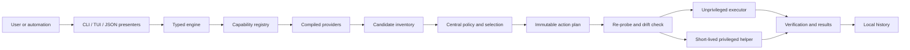

# LDC — Linux Deep Clean design report

This report records the approved end-state product, safety, and architecture design. It is deliberately not an implementation plan, milestone schedule, or task breakdown.

## Executive decision

Build **LDC — Linux Deep Clean** as an independent, Apache-2.0-licensed Linux product. The distributed package is `linux-deep-clean`; the executable is `ldclean`. Do not install an `ldc` executable or alias because `ldc` is already the established LLVM D compiler command on Debian, Fedora, and Arch Linux.

LDC targets semantic feature parity with Mole: the same user jobs and command families, expressed through Linux-native package managers, filesystems, services, desktop conventions, and hardware interfaces. It does not imitate Apple-only implementation details or unsafe “optimization” folklore.

The selected implementation is **Go-first**: one Go codebase, one unprivileged user binary, and one narrowly scoped privileged helper included only in native packages. All interfaces—interactive TUI, conventional CLI, JSON, and NDJSON—use the same typed discovery, planning, validation, and execution engine.

The governing invariant is:

> LDC never turns a path guess into a deletion. Every mutation comes from typed evidence, becomes an immutable action plan, and is revalidated at the point of use.

## Approved decisions

| Area | Decision |
|---|---|
| Product | Independent Linux-native tool; not a Linux port or fork |
| Brand | **LDC — Linux Deep Clean** |
| Package / repository slug | `linux-deep-clean` |
| Executable | `ldclean`; never claim `ldc` |
| Scope | End-state semantic parity with Mole’s public CLI capabilities |
| Architecture | Go-first, compiled providers, shared typed engine |
| Privilege | Main process never runs as root; short-lived typed helper for selected actions |
| Default behavior | Plan/preview first; mutation requires an explicit apply action |
| License | Apache-2.0 for original LDC code; clean-room-style provenance controls |
| Distribution | Native `.deb`, `.rpm`, and Arch packages; signed rootless archive as a reduced-capability fallback |
| Support posture | Mutation only on an explicitly tested Linux matrix; read-only degraded mode elsewhere |
| Planning | Deferred to a later session; this document is the approved design input |

## Product definition

### Problem

Linux users can combine package-manager cleanup, disk analyzers, journal tools, Trash utilities, project-artifact scanners, application uninstallers, and system monitors, but the safety and interaction models differ. A shell script that aggregates those commands would amplify path, quoting, privilege, and distro-compatibility failures.

LDC provides one terminal-first workflow with:

- an explainable inventory before mutation;
- one safety model across user files, package managers, and privileged maintenance;
- package- and distro-aware behavior rather than raw deletion of manager-owned data;
- interactive and machine-readable interfaces backed by identical semantics;
- durable local history and honest reversibility labels.

### What “full parity” means

Full parity means equivalent user outcomes for Mole’s documented command families at the end-state release. It does not mean reproducing undocumented implementation details, copying cleanup rule lists, or inventing Linux equivalents for Apple-specific APIs when no safe equivalent exists.

Parity is judged by jobs:

- clean recreatable caches, bounded logs, and evidenced remnants;
- uninstall installed applications and attributable leftovers;
- perform safe, evidence-backed maintenance;
- explore disk use and move selected items to Trash;
- monitor live system health;
- find and purge project build artifacts;
- find installer artifacts;
- configure supported fingerprint authentication for privileged prompts;
- generate shell completion, inspect history, update, and remove the tool.

Capability gaps caused by unavailable hardware, missing optional services, or unsupported distro mechanisms are reported explicitly. They are never silently simulated.

### Product differentiation

LDC is not intended to beat every specialist at its specialty. BleachBit is an established cleaner, ncdu/gdu are focused disk explorers, Czkawka focuses on duplicate/media analysis, and Stacer/Nexis-style products emphasize a graphical system dashboard. LDC’s differentiator is the combination of:

1. typed evidence and immutable previews;
2. Linux package ownership awareness;
3. descriptor-anchored filesystem mutation;
4. a small, audited privilege boundary;
5. one stable contract for TUI, CLI, JSON, and history.

## Recommended constraints

These constraints are part of the approved v1 contract. “v1” describes the first release permitted to claim the complete design, not a reduced MVP.

### Supported mutation matrix

| Distribution | Releases | Architectures | Required package backend |
|---|---|---|---|
| Ubuntu LTS | 22.04, 24.04, 26.04 | x86_64, aarch64 | APT/dpkg |
| Debian | 12, 13 | x86_64, aarch64 | APT/dpkg |
| Fedora Workstation/Server, non-atomic | 43, 44 | x86_64, aarch64 | DNF5/RPM |
| Arch Linux | Current, fully upgraded | x86_64 | Pacman |

All supported systems must use systemd, expose procfs, run Linux kernel 5.15 or newer, and use local ext4, XFS, or Btrfs filesystems for mutated paths. A desktop environment is optional; every TUI flow must have a non-TUI CLI equivalent.

On other Linux systems, LDC may run read-only discovery, analysis, status, and plan generation when it can prove those operations safe. Mutation remains disabled until that exact platform joins the tested matrix.

### Explicitly unsupported for mutation

- NixOS, Guix System, Fedora Atomic variants, image-based or otherwise immutable hosts;
- WSL, containers, chroots, live media, and rescue environments;
- non-systemd systems;
- network, FUSE, overlay, ZFS, and removable filesystems;
- paths crossing a mount boundary from an approved root.

These environments may be detected and explained. `--force` must not turn an unsupported environment into a supported one.

### Deliberate non-goals

- GUI, tray process, daemon, scheduler, or unattended cleanup;
- arbitrary plugin scripts or downloaded cleanup rule packs;
- general package upgrades, firmware updates, automatic kernel removal, or automatic orphan removal; `ldclean update` is limited to the exact LDC package and its disclosed manager-resolved dependencies;
- raw deletion inside package-manager databases or caches owned by a native cleanup command;
- clearing page cache, changing sysctls, disabling services, modifying firewall/network settings, or promising generic “speed boosts”;
- secure erase, block-device operations, filesystem repair, or partition management;
- perceptual duplicate detection;
- deletion of documents, source files, browser history, cookies, credentials, or application data; a selected native-manager uninstall may have separately disclosed manager-owned effects, but LDC never adds an independent data-removal action;
- scanning private mail or cloud-client databases for installers;
- hand-editing PAM configuration;
- telemetry, advertising, accounts, or cloud synchronization.

## Command contract

The primary grammar is `ldclean <command> [options]`. With no command, a TTY opens the capability-aware menu; a non-TTY prints help and exits without mutation.

| Command | Linux-native semantic contract | Mutation boundary |
|---|---|---|
| `ldclean` | Open the interactive command menu, or help when no TTY exists | None until the user explicitly applies a generated plan |
| `clean` | Inventory recreatable XDG caches, bounded user logs, manager-owned caches through native APIs, and exactly attributable leftovers; report Trash usage read-only | Selected typed actions only; package data through its owner; LDC never empties Trash |
| `uninstall` | Inventory native, Flatpak, Snap, and evidenced user-installed applications; preview package removal plus attributable leftovers | Native manager removes the selected package; residue actions are separate and independently selectable |
| `optimize` / `optimise` | Audit health and propose only measurable Linux maintenance such as bounded journal vacuuming or an owner-provided cache rebuild | No generic tuning; only allowlisted actions with a stated postcondition |
| `analyze` / `analyse` | Interactive disk explorer for an explicit local root, with apparent and allocated sizes, large-file views, refresh, preview, and JSON output | User-selected ordinary files go to a Freedesktop Trash location; unsupported mounts are read-only |
| `status` | Live CPU, memory, load, disks, I/O, network, process, power, thermal, and optional GPU dashboard with an explainable health score | Read-only |
| `history` | Query local run, action, result, error, and reversibility records; filter and emit human, JSON, or NDJSON output | Queries are read-only; repair or deletion requires a separate previewed state-management apply action |
| `purge` | Discover known build/dependency artifacts only beneath configured project roots and only with matching project evidence | Selected artifacts go to Trash by default; permanent removal is a separately labeled action |
| `installer` | Discover installer artifacts in the XDG Downloads directory and user-configured roots; classify using file type, magic, and provenance | Selected ordinary files go to Trash; package caches remain the package provider’s responsibility |
| `fingerprint` | Report and, where a distro-supported mechanism exists, enable/disable fprintd-backed authentication for privileged prompts | Uses `pam-auth-update` or `authselect`-class supported mechanisms; otherwise guidance only |
| `completion` | Generate or install Bash, Zsh, and Fish completion | User-owned completion paths by default; system install requires a typed helper action |
| `update` | Check the installed channel and hand an explicit request to the native package manager | Never self-replaces; a rootless archive only reports/download-verifies a release for manual replacement |
| `remove` | Preview removal of the `linux-deep-clean` package; a rootless archive reports its exact running binary and manual removal guidance | Native manager owns package removal; an archive never self-deletes; user config/state is preserved unless separately selected |
| `--help`, `--version` | Stable, fast, offline informational output | Read-only |

### Shared interaction rules

- Every mutating command produces a complete plan before it can apply anything.
- Interactive confirmation or an explicit `--apply` is required. `--yes` may suppress the second confirmation but never implies `--apply`.
- `--dry-run` is an unconditional no-mutation, no-network guarantee.
- `--json` emits one versioned document. `--ndjson` emits versioned streaming events where streaming is useful.
- When structured output is requested, prompts, spinners, color, and decorative text are disabled; diagnostics go to stderr.
- `--debug` increases local diagnostic detail without relaxing validation or exposing credentials.
- `--whitelist` remains as a compatibility-facing name for managing protected paths/actions; internal and prose terminology is “protection list.”
- Protection entries can only remove candidates or actions from a plan. They cannot broaden a provider’s roots.
- Non-interactive mutation without both an explicit apply request and a fully resolvable selection is rejected.

### Exit-status contract

| Code | Meaning |
|---:|---|
| 0 | Command completed; all requested actions reached a terminal successful or skipped state |
| 1 | General discovery, execution, or internal error |
| 2 | Invalid arguments or unresolved non-interactive selection |
| 3 | Plan expired through state drift and must be regenerated |
| 4 | Partial result; at least one action failed after others completed |
| 5 | Authorization denied or required privilege mechanism unavailable |
| 6 | Platform or capability unsupported for the requested operation |

The structured result contains action-level statuses and is authoritative; the process code is its summary.

## Architecture evaluation

### Option A — Go-first, selected

One Go codebase builds the user application and privileged helper. Cobra provides CLI parsing, Bubble Tea v2 and Lip Gloss v2 provide the TUI, `golang.org/x/sys/unix` exposes Linux descriptor-relative primitives, and a normalized metrics adapter may use gopsutil v4 after support-matrix validation.

**Strengths**

- fastest route to complete CLI/TUI parity with a single static-style executable per architecture;
- straightforward concurrency and cancellation for large scans and live metrics;
- direct access to `openat2`, `statx`, `unlinkat`, and related Linux syscalls;
- simple cross-compilation and broad Linux packaging familiarity;
- one language across the trusted engine, provider adapters, and helper.

**Costs**

- garbage collection requires explicit memory and latency budgets during million-entry scans;
- safe syscall use still requires careful descriptor ownership and adversarial tests;
- some Linux data is byte-oriented while Go strings are conventionally UTF-8, so paths need an explicit lossless representation.

### Option B — Rust-first

Rust with clap, Ratatui, and rustix would give excellent low-level control and make some resource-lifetime mistakes harder.

**Strengths:** strong type and memory safety, explicit ownership, excellent syscall wrappers, predictable memory behavior.

**Costs:** longer delivery and review curve for the likely contributor base, more friction in high-level TUI/provider work, and no automatic solution to TOCTOU, package semantics, or privilege design. It is the best fallback if Go cannot meet measured memory or syscall-safety requirements.

### Option C — Bash plus a compiled TUI/helper

This most closely resembles the upstream implementation shape and makes early distro command integration quick.

**Strengths:** rapid command prototyping, native tools are easy to invoke, low initial scaffolding.

**Costs:** quoting and byte-path hazards, locale-sensitive parsing, duplicated policy, weak typed contracts, difficult cancellation, and a large audit surface at the privilege boundary. It optimizes the first demos at the expense of the core safety claim.

### Decision scorecard

Scores are relative (5 is strongest) and reflect this product’s priorities.

| Criterion | Weight | Go-first | Rust-first | Bash hybrid |
|---|---:|---:|---:|---:|
| Safety architecture fit | 30% | 4 | 5 | 2 |
| Full-parity delivery | 25% | 5 | 3 | 4 |
| Linux packaging reach | 15% | 5 | 4 | 4 |
| TUI and CLI productivity | 10% | 5 | 4 | 4 |
| Contributor maintainability | 10% | 5 | 3 | 2 |
| Performance predictability | 10% | 4 | 5 | 2 |
| Weighted result | 100% | **4.6** | **4.1** | **3.0** |

Go-first wins because it best balances the non-negotiable safety design with the breadth of parity. The filesystem and helper layers remain small enough for focused review and fuzzing.

## Selected system architecture

### Deployable binaries

1. `/usr/bin/ldclean`
   - runs only unprivileged and exits with guidance when its effective UID is 0;
   - owns discovery, policy, presentation, plan generation, unprivileged application, verification, and user history;

2. `/usr/libexec/linux-deep-clean/helper`
   - installed only by native packages;
   - invoked for a single approved plan through polkit, with a `sudo` fallback;
   - exposes a fixed action vocabulary, not a shell or generic command runner;
   - exits after returning typed results.

The signed generic archive has only one executable, `ldclean`; it may also carry completions, license text, and documentation, but never the helper or polkit metadata. It operates rootlessly and marks privileged capabilities unavailable. There is no resident root service.

### Logical modules

| Module | Responsibility | Must not do |
|---|---|---|
| Presenters | Cobra commands, Bubble Tea views, human/JSON/NDJSON rendering | Discover or delete paths |
| Capability registry | Detect distro, managers, services, mounts, hardware, and privilege channel | Infer support from distro name alone |
| Providers | Discover candidates and propose typed actions with evidence | Execute arbitrary commands or mutate state |
| Domain | Candidate, evidence, preconditions, action, plan, result, schema versions | Import UI or distro-specific packages |
| Policy engine | Protection lists, support gates, risk classes, selection, plan totals | Expand provider roots |
| Linux filesystem | Anchored resolution, metadata snapshots, Trash/quarantine operations | Accept untrusted absolute paths at apply time |
| Manager executor | Fixed native-manager actions and result normalization | Pass arbitrary argv, environment, or shell text |
| Privilege client/helper | Authorization, framed protocol, independent validation | Trust the main process’s safety conclusion |
| Metrics | Normalize procfs/sysfs/manager metrics and health score inputs | Invent unavailable values |
| State | Config, plans, history, preferences, redaction, schema migration | Store secrets or transmit telemetry |

### Core domain model

The domain contract is shared by all interfaces and both binaries.

- **Candidate:** a discoverable object, its provider, trusted-root identity, lossless relative path or manager object ID, size facts, and evidence.
- **Evidence:** the observation that justifies classification—XDG cache boundary, package ownership, manifest reference, project marker, file magic, journal metadata, or exact manager query.
- **Precondition:** the state that must still hold at apply time—device, mount ID, inode, type, owner, mode, link count where relevant, size, timestamps, package version/state, and provider-specific facts.
- **Action:** a fixed operation kind, target, evidence, safety class, reversibility class, estimated effect, required capability, and expected postcondition.
- **Plan:** immutable schema version, command, caller, capability snapshot, config digest, selected actions, totals, creation context, and deterministic digest.
- **Result:** per-action terminal status, verified effect, error category, reversal handle when real, and aggregate summary.

Filesystem targets are stored as a trusted root ID plus a byte-preserving relative path. Human output adds an escaped display form; JSON adds an encoded form whenever a name is not valid UTF-8. The privileged helper never accepts a caller-supplied absolute pathname as authority.

### Action vocabulary

The initial protocol vocabulary is closed and versioned. Representative kinds are:

- `trash_path`, `delete_recreatable_path`, `quarantine_path`;
- `remove_native_package`, `remove_flatpak_ref`, `remove_snap`;
- `clean_package_cache`, `vacuum_journal`;
- `run_owned_cache_rebuild`;
- `install_completion`;
- `configure_fingerprint_auth`;
- `remove_ldclean_package`.

Adding an action kind is a public security-contract change requiring helper, policy, schema, documentation, and adversarial-test review.

### Execution lifecycle

1. **Detect:** establish kernel, distro, package backends, mounts, optional services, and exact supported capabilities.
2. **Collect:** providers inventory candidates without mutation or network access.
3. **Classify:** attach evidence, preconditions, ownership, size, risk, and reversibility.
4. **Protect:** central policy removes unsupported, protected, ambiguous, or cross-boundary candidates.
5. **Select:** user or deterministic CLI selectors choose from the bounded inventory.
6. **Plan:** serialize the immutable action list and compute its digest.
7. **Authorize:** request privilege only if selected actions require it, and show that subset before the prompt.
8. **Re-probe:** each executor independently verifies platform support and target preconditions immediately before use.
9. **Apply:** execute actions in dependency order; unrelated actions continue only when policy says partial completion is safe.
10. **Verify:** measure the postcondition and actual apparent/allocated bytes affected.
11. **Record:** append redacted local events and return an action-level result.

There is no claim of transactionality across filesystems or package managers. “Undo” is offered only when LDC holds a valid Trash or quarantine restoration handle. Package reinstall suggestions are not labeled rollback.

## Linux provider model

Providers are compiled, separately testable adapters selected by capability probes. There is no runtime plugin marketplace and no execution of downloaded rule files.

| Provider | Discovery authority | Mutation authority |
|---|---|---|
| XDG/cache | Freedesktop base-directory boundaries and explicit application cache manifests | Anchored filesystem executor |
| Trash | Freedesktop Trash specification and mount capabilities | Same-mount atomic move with collision-safe metadata |
| APT/dpkg | `dpkg-query`, APT simulation, package state and ownership | Fixed APT/dpkg operations after lock and plan recheck |
| DNF5/RPM | DNF5/RPM queries and transaction preview | Fixed DNF5 operation after lock and plan recheck |
| Pacman | Pacman database queries; `paccache` capability when installed | Fixed Pacman/paccache operations after lock and plan recheck |
| Flatpak | Installed refs and documented dry-run/query output | Flatpak command with an exact selected ref and installation scope |
| Snap | Installed snaps and documented model assertions | Snap command with an exact selected snap and scope |
| journald/systemd | Journal usage, retention, units, and timers | Only bounded documented maintenance actions; no arbitrary service changes |
| Applications | Native package ownership, Flatpak/Snap refs, or exact user-install provenance | Owning manager first; separately evidenced residue actions second |
| Projects | Ecosystem markers plus curated artifact relationships | Trash or explicit recreatable deletion beneath configured roots |
| Installers | XDG Downloads/configured roots, file type/magic, and package provenance | Trash only |
| Metrics | procfs, sysfs, cgroups where applicable, UPower/fprintd capabilities | Read-only |
| Fingerprint | fprintd plus distro-supported PAM management capability | Fixed enable/disable operation with backup and verification |

Provider output is data, not policy. A provider can propose an action; only the central engine can admit it to a plan.

### Package-manager rules

- Always use the manager’s documented simulation or query mode before a transaction.
- Recheck the selected package ID, installed version, dependency consequences, repository/channel, and manager lock immediately before apply.
- If preview and apply state differ, reject with plan-drift status; never “best effort” a changed transaction.
- Never parse localized prose when a stable machine format or database query exists. Force a minimal locale for unavoidable command output.
- Never remove packages classified as essential/protected, the active desktop/session foundation, the running kernel, the active package manager, or LDC’s helper dependencies through a generic uninstall flow.
- Orphan/dependency cleanup is shown only as a native manager recommendation; it is not automatically selected.
- Residue discovery requires exact ownership or a high-confidence manifest relationship. Name similarity alone is insufficient.
- Residue actions are limited to recreatable caches and inert integration files with exact provenance. User configuration, XDG data/state, documents, credentials, and active application content may be reported for manual review but are never selected or deleted as leftovers.

### Project purge rules

An artifact such as `node_modules`, `target`, `.build`, `build`, or `dist` is not safe merely because of its basename. A purge candidate requires:

- containment beneath a configured local project root;
- a matching ecosystem marker or manifest in the correct ancestor;
- no symlink or mount traversal;
- an artifact-specific rule declaring whether the content is reproducible;
- an explicit selection, with deployment outputs such as `dist` defaulting unselected;
- a final anchored revalidation.

Git cleanliness can be displayed as evidence but is not treated as proof that untracked artifacts are disposable.

## Filesystem safety design

### Descriptor-anchored resolution

Every mutation starts from an already approved directory file descriptor. On supported kernels, LDC requires `openat2(2)` with:

- `RESOLVE_BENEATH`;
- `RESOLVE_NO_SYMLINKS`;
- `RESOLVE_NO_MAGICLINKS`;
- `RESOLVE_NO_XDEV`.

It captures `statx` metadata, including device, inode, type, ownership, timestamps, and mount ID where available, then performs descriptor-relative operations such as `unlinkat` or collision-safe rename. The executor fails closed if the required resolution guarantees are unavailable. It does not fall back to string-prefix checks or `realpath`-then-delete.

Hard links, bind mounts, magic links, special files, sockets, device nodes, and unexpected type changes are surfaced and rejected according to action policy. Special files are never generic cleanup candidates.

### Revalidation and race behavior

The plan records discovery preconditions, but those facts are not trusted indefinitely. Immediately before mutation, the responsible executor:

1. reopens beneath the trusted root using the required resolution flags;
2. compares the complete required metadata snapshot;
3. verifies the target’s provider evidence is still valid where applicable;
4. atomically stages an irreversible leaf with `renameat2(RENAME_NOREPLACE)` into an executor-controlled same-filesystem location, then reopens and compares the staged object;
5. rejects any mismatch without unlinking it, restoring it when that can be done without overwriting another object and otherwise retaining it as a recoverable quarantine item;
6. applies through anchored descriptors only after the staged identity matches;
7. verifies the expected postcondition.

Linux has no general “unlink this already-open inode” operation. LDC therefore does not claim that a metadata check followed by a pathname-based unlink is atomic. If it cannot establish protected same-filesystem staging, it uses Trash/quarantine or refuses irreversible deletion. Rootless mode never substitutes a weaker final-component check merely to complete an action.

The release gate includes at least 10,000 adversarial symlink, rename, inode-reuse, and mount-swap iterations with zero escape outside the disposable test root.

### Trash, quarantine, and deletion

- User-selected ordinary files from `analyze`, `installer`, and default `purge` use the Freedesktop Trash specification.
- LDC prefers a same-filesystem atomic rename and writes the required Trash metadata durably.
- If a compliant Trash location cannot be established without crossing policy boundaries, the action is refused rather than silently converted to permanent deletion.
- LDC may report Trash usage but never empties Trash; recovery destinations do not become cleanup targets.
- Permanent deletion is limited to evidence-backed recreatable data and is labeled irreversible.
- Quarantine, where used, is on the same approved filesystem, has an explicit retention policy, and does not count as freed space until removed.
- Apparent bytes and allocated bytes are measured and reported separately. Savings are never inferred solely from pathname size gathered before apply.

## Privilege and helper boundary

### Authorization

Native packages install a polkit action for the helper. If a graphical/text polkit agent is unavailable, LDC may offer a `sudo` fallback that executes the same helper and protocol. The authorization prompt lists the privileged action count and categories; discovery never requires elevation.

The threat model assumes root and the kernel are trusted. A hostile process under another UID, the environment, candidate tree, and concurrent package operation are not trusted. A malicious process already running as the caller UID with equivalent filesystem and ptrace rights is in the same operating-system trust domain: LDC still detects ordinary concurrent drift and prevents root/path escape, but cannot isolate the user from that peer without changing the host security model.

### Protocol

- stdin/stdout carry a size-limited, length-framed, versioned typed request and response;
- canonical CBOR is the preferred wire encoding because it preserves byte paths and supports deterministic plan digests;
- the request ceiling is 4 MiB; an oversized privileged selection is rejected and must be reduced and re-planned rather than being split invisibly;
- decoding rejects unknown required fields, duplicate keys, excessive nesting, indefinite lengths, and unsupported schema versions;
- the helper accepts fixed enums and validated IDs, never shell text, arbitrary executable paths, arbitrary argv, or inherited environment;
- manager commands use fixed absolute executables, fixed argument templates, a minimal environment, closed extra file descriptors, and normalized locale;
- the helper derives and checks caller identity from the trusted authorization channel, validates the plan digest, repeats support probes, and rechecks every privileged precondition;
- results distinguish success, skipped, drifted, denied, unsupported, and failed states.

A root user can always bypass a user-space tool, so protection against an already hostile root is outside scope. Protection against a compromised or buggy unprivileged `ldclean` process is inside scope: the helper must still reject actions outside its compiled authority.

### Fingerprint authentication

`ldclean fingerprint` is the semantic replacement for Mole’s Touch ID command. It may use fprintd only when fingerprint enrollment and a distro-supported PAM management mechanism are detected. Debian/Ubuntu-class systems use the supported `pam-auth-update` workflow; Fedora-class systems use the supported `authselect` workflow. Arch remains read-only guidance unless a safely automatable native mechanism is established and tested.

LDC never edits PAM files with ad hoc text replacement. Enable/disable plans identify the exact profile change, back up manager-owned configuration when the manager supports it, and verify that password authentication remains available.

## User interface and output contracts

### TUI

Bubble Tea v2 and Lip Gloss v2 provide the interactive menu, selectors, disk explorer, status dashboard, progress, and confirmation views. The TUI is a presenter over engine events; it has no filesystem or package mutation code.

Keyboard access includes arrows and Vim-style navigation where meaningful, clear focus, a no-color mode, terminal-resize handling, and cancellation. Capability absence is shown as unavailable with a reason, not hidden as if successfully completed.

### Machine-readable output

- Every document/event has a schema version and command/run ID.
- Valid structured output is written only to stdout; diagnostics use stderr.
- Paths include a safe display value and, when needed, an exact base64 byte representation.
- Sizes include units and distinguish apparent, allocated, estimated, and verified values.
- Missing metrics are `null` with a capability reason, never zero-filled.
- `status` automatically chooses a single JSON snapshot when stdout is not a TTY unless the user explicitly requests human output.
- Cancellation produces a terminal result event and leaves already completed actions recorded.

### Health score

The status health score is a documented, versioned calculation over available normalized inputs. Each component contribution is inspectable. Unsupported sensors are omitted with weight renormalization; they do not penalize or improve a host. Thresholds can be configured, and sustained high-CPU process alerts remain read-only.

## Configuration, state, and privacy

LDC follows the XDG Base Directory specification:

| Data | Default location | Mode |
|---|---|---:|
| Configuration and protection lists | `$XDG_CONFIG_HOME/linux-deep-clean/config.toml` | directory 0700, file 0600 |
| Run plans, results, and operation history | `$XDG_STATE_HOME/linux-deep-clean/` | directory 0700, files 0600 |
| Rebuildable scan indexes | `$XDG_CACHE_HOME/linux-deep-clean/` | directory 0700 |
| Ephemeral authorization/plan material | `$XDG_RUNTIME_DIR/linux-deep-clean/` | directory 0700 |

Defaults use the specification’s fallbacks when variables are unset. Configuration paths are never treated as cleanup candidates. History is an append-oriented, versioned local event log with atomic run summaries. Reads report a corrupt tail without changing it; a separate repair plan preserves the original and writes a verified replacement only after explicit apply.

History may contain sensitive pathnames, so it is private by default, supports display redaction, and can be disabled with configuration or `LDCLEAN_NO_HISTORY=1`. Debug logs follow the same permissions and redaction policy. LDC has no telemetry and makes no network request during discovery, preview, status, help, or dry-run. Apply is offline except for an explicit native package-manager transaction whose preview disclosed the network requirement; an explicit update check may also use the network.

## Packaging and release posture

### Artifacts

- Debian/Ubuntu `.deb` named `linux-deep-clean`;
- Fedora `.rpm` named `linux-deep-clean`;
- Arch package/PKGBUILD named `linux-deep-clean`;
- signed `.tar.zst` containing the rootless `ldclean` binary plus completions, license, and documentation.

Native packages own `/usr/bin/ldclean`, `/usr/libexec/linux-deep-clean/helper`, completions, manual pages, and polkit metadata. Package removal is delegated to the native manager. User state is retained by default to avoid destructive surprise.

There is no curl-pipe-shell installer, AppImage, Flatpak, Snap, or container distribution for v1. Those channels either weaken the helper model, conflict with host-maintenance permissions, or blur ownership. Release artifacts include signed checksums, SBOMs, reproducible-build metadata where achievable, and provenance attestations.

### Update behavior

`ldclean update` never overwrites its own executable. For native installations it checks and, only after explicit apply, invokes the manager for the exact `linux-deep-clean` package. For a rootless archive it verifies release metadata and prints a manual replacement path; automatic package-bypassing replacement is unsupported.

### Dependency policy

The design assumes the current stable Go toolchain at implementation time and these narrow dependency roles:

- Cobra for the command tree and completions;
- Bubble Tea v2 and Lip Gloss v2 for terminal presentation;
- `golang.org/x/sys/unix` for Linux syscalls;
- a canonical CBOR implementation for the helper protocol;
- optionally gopsutil v4 behind LDC’s metrics interface if validation shows it improves support without weakening accuracy.

Exact patch versions are an implementation-plan decision and must be pinned after license, vulnerability, maintenance, and support-matrix review. Standard-library facilities are preferred for structured logging, process control, hashing, and JSON.

## Independent implementation and licensing

Mole is GPL-3.0 and its name/logo are governed by its trademark policy. LDC must be independently authored and visually distinct.

Required provenance controls:

- use the public README, observed CLI behavior, and this approved report as the compatibility specification;
- do not copy Mole source, prose, artwork, test fixtures, cleanup rule tables, or distinctive TUI layouts;
- implementation contributors should not consult upstream internals when this report supplies the needed behavior;
- record the origin and license of every third-party rule, fixture, icon, and dependency;
- use original terminology and interaction design except generic command concepts needed for compatibility;
- perform a license/provenance review before the first public release.

“Clean-room-style” describes the engineering process, not a legal opinion. Apache-2.0 applies only to original LDC work and compatible dependencies.

## Validation and release gates

### Test layers

1. **Domain unit and property tests:** action admission, protection monotonicity, plan determinism, schema compatibility, size arithmetic, health score, and exit summaries.
2. **Filesystem adversarial tests:** invalid UTF-8 names, deep trees, permission changes, hard links, symlinks, magic links, bind mounts, rename races, inode replacement, mount replacement, special files, and cancellation.
3. **Fuzzing:** path decoding, config, JSON/NDJSON, CBOR protocol, provider parsers, manager preview normalization, and history recovery.
4. **Provider integration tests:** real package fixtures and disposable package-manager databases; no test-only behavior in production code.
5. **Privilege tests:** polkit/sudo denial, caller mismatch, oversized/malformed protocol, unknown actions, arbitrary argv attempts, plan drift, lock contention, and helper interruption.
6. **Golden contract tests:** help, human preview, JSON schemas, NDJSON streams, error messages, completion, and no-TTY behavior.
7. **VM destructive tests:** snapshot-backed real distributions, loopback filesystems, native package transactions, journald, Trash, fprintd capability probes, install/update/remove, and recovery after forced interruption.
8. **Race/static/supply-chain gates:** Go race detector, vet/lint, vulnerability scan, SBOM, package linting, and signature verification.

### VM matrix

The full mutation claim requires 15 real VM targets: six Ubuntu, four Debian, four Fedora, and one Arch target from the supported architecture/release combinations. Every pull request gates at least Ubuntu 24.04 x86_64, Debian 13 x86_64, Fedora 44 x86_64, and current Arch x86_64. Nightly and release candidates exercise all 15.

### Measurable acceptance thresholds

Measured on a documented reference machine and warm filesystem cache unless a test explicitly targets cold I/O:

| Measure | Threshold |
|---|---:|
| `--help` / `--version` p95 | ≤ 150 ms |
| TUI first paint p95 | ≤ 300 ms |
| 100,000-entry inventory | ≤ 2 s and ≤ 128 MiB RSS |
| 1,000,000-entry deep scan | ≤ 60 s and ≤ 256 MiB RSS |
| Default concurrency | ≤ 4 scanning workers and ≤ 128 open file descriptors |
| Cancellation to quiescence | ≤ 1 s, excluding an already-running non-interruptible manager transaction |
| Dry-run side effects | zero filesystem mutation, authorization prompts, and network requests |
| Controlled ext4 freed-space estimate | within max(5%, 64 MiB) of verified allocated-byte change |
| Adversarial path-swap campaign | 10,000 iterations, zero mutation outside the disposable root |

Provider-specific performance may be I/O-bound, but memory, descriptor, and cancellation bounds remain enforced.

### Product acceptance

The release may claim full parity only when:

- every command in the command contract has both interactive and non-interactive behavior;
- mutating commands share the same typed plan/apply engine;
- every supported distro/architecture passes its destructive VM suite;
- unsupported environments fail closed with actionable explanations;
- JSON/NDJSON schemas and exit codes are documented and contract-tested;
- package transactions and filesystem actions pass drift/race tests;
- history accurately distinguishes estimated, attempted, verified, skipped, drifted, and failed effects;
- no command needs the main TUI/CLI process to run as root;
- provenance, dependency, package, and security reviews are complete.

## Principal risks and responses

| Risk | Consequence | Design response |
|---|---|---|
| Preview/apply package drift | A different dependency transaction runs | Capture exact preview state, manager lock/state, and package version; reject and re-plan on change |
| Symlink, inode, or mount swap | Deletion escapes the selected tree | Descriptor-anchored `openat2` resolution, `statx` preconditions, point-of-use recheck, zero-fallback policy |
| False app-leftover attribution | User data is misclassified | Require ownership/manifest evidence; separate package and residue actions; ambiguity defaults to skip |
| Project artifact basename collision | Source/deployment data is removed | Require ecosystem context, explicit selection, Trash default, high-risk artifacts unselected |
| Helper becomes a generic root primitive | Privilege escalation | Fixed action enums, trusted roots, no shell/arbitrary argv, independent validation, short lifetime |
| Distro command/output changes | Incorrect plans or broken parsing | Capability probes, machine formats, real VM fixtures, release-specific support gates |
| Misleading “optimization” | Harmful tuning or false claims | Only actions with a documented owner and measurable postcondition; otherwise recommendation-only |
| Misleading freed-space totals | User distrust and bad decisions | Separate apparent/allocated/estimated/verified values; quarantine is not counted as freed |
| Broad parity delays release | Scope pressure weakens safety | Treat safety core as a prerequisite and deliver capability slices later without claiming full parity early |
| Brand/command collision | Breaks existing D compiler workflows | Use `ldclean` exclusively; package/repository use `linux-deep-clean` |
| GPL/trademark contamination | Relicensing or branding dispute | Original implementation, distinct identity, provenance log, pre-release legal/license review |

## Open implementation choices

No product or architecture question blocks planning. The later implementation plan should settle only lower-level choices against this design, including:

- exact Go and dependency patch versions;
- the canonical CBOR library after audit;
- whether gopsutil or direct procfs/sysfs readers better satisfy each metric;
- exact package repository/signing infrastructure;
- the documented reference hardware for performance gates;
- the safe per-distro fingerprint mutation matrix after disposable-VM validation.

Changing the executable name, support matrix, privilege boundary, plan-first invariant, semantic parity target, or explicit exclusions requires a new user decision rather than an implementation convenience.

## Future planning handoff

A later, separately authorized plan must translate this design into implementation work covering the safety core, read-only capabilities, user-owned cleanup providers, package/distro adapters, bounded privileged maintenance, packaging, and parity qualification. Phase order, tasks, estimates, and scheduling remain deliberately undecided.

## Research evidence and references

### Upstream behavior and constraints

- [tw93/Mole repository](https://github.com/tw93/Mole)
- [Mole README at the researched commit](https://github.com/tw93/Mole/blob/7c681aef35d0dca6d1c3bdd85333ff571dc4be00/README.md)
- [Mole command dispatcher at the researched commit](https://github.com/tw93/Mole/blob/7c681aef35d0dca6d1c3bdd85333ff571dc4be00/lib/core/commands.sh)
- [Maintainer statement that Linux requires a substantial rewrite](https://github.com/tw93/Mole/issues/639#issuecomment-4139471888)
- [Closed Linux support proposal PR #820](https://github.com/tw93/Mole/pull/820)
- [Mole GPL-3.0 license](https://github.com/tw93/Mole/blob/main/LICENSE)
- [Mole trademark policy](https://github.com/tw93/Mole/blob/main/TRADEMARK.md)

### Linux platform contracts

- [XDG Base Directory specification](https://specifications.freedesktop.org/basedir-spec/latest/)
- [Freedesktop Trash specification](https://specifications.freedesktop.org/trash/latest/)
- [`openat2(2)` manual](https://www.man7.org/linux/man-pages/man2/openat2.2.html)
- [`statx(2)` manual](https://man7.org/linux/man-pages/man2/statx.2.html)
- [`unlinkat(2)` manual](https://man7.org/linux/man-pages/man2/unlinkat.2.html)
- [`pkexec(1)` documentation](https://polkit.pages.freedesktop.org/polkit/pkexec.1.html)
- [APT `apt-get(8)` documentation](https://manpages.debian.org/unstable/apt/apt-get.8.en.html)
- [DNF5 `clean` documentation](https://dnf5.readthedocs.io/en/stable/commands/clean.8.html)
- [Arch `paccache(8)` documentation](https://man.archlinux.org/man/paccache.8)
- [Flatpak command reference](https://docs.flatpak.org/en/latest/flatpak-command-reference.html)
- [Snap command documentation](https://snapcraft.io/docs/tutorials/get-started/)

### Identity collision evidence

- [Debian `ldc` package](https://packages.debian.org/sid/ldc)
- [Fedora `ldc` package](https://packages.fedoraproject.org/pkgs/ldc/ldc/)
- [Arch `ldc` package](https://archlinux.org/packages/extra/x86_64/ldc/)
- [Arch package file list containing `/usr/bin/ldc`](https://archlinux.org/packages/extra/x86_64/ldc/files/)

### Selected and alternate implementation ecosystems

- [Go `golang.org/x/sys/unix`](https://pkg.go.dev/golang.org/x/sys/unix)
- [Bubble Tea releases](https://github.com/charmbracelet/bubbletea/releases)
- [Cobra](https://github.com/spf13/cobra)
- [Ratatui](https://github.com/ratatui/ratatui)
- [Rustix filesystem API](https://docs.rs/rustix/latest/rustix/fs/)
